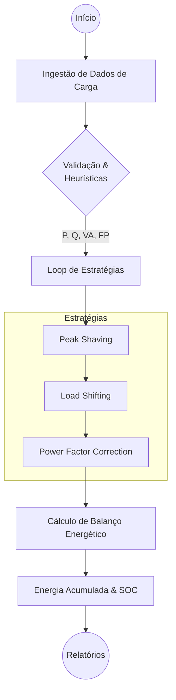

# Visão Geral do Fluxo EMS

Este diagrama descreve o fluxo de alto nível do `EMSManager`, desde a ingestão de dados até o cálculo do SOC heurístico.

```mermaid
flowchart TD
    Start((Início)) --> Ingest[Ingestão de Dados de Carga]
    Ingest --> Valida{Validação &<br/>Heurísticas}
    Valida -->|P, Q, VA, FP| StratLoop[Loop de Estratégias]
    
    subgraph Estratégias
        Peak[Peak Shaving]
        Load[Load Shifting]
        PFC[Power Factor Correction]
    end
    
    StratLoop --> Peak
    Peak --> Load
    Load --> PFC
    
    PFC --> Integracao[Cálculo de Balanço Energético]
    Integracao --> SOC[Energia Acumulada & SOC]
    SOC --> End((Relatórios))
```
