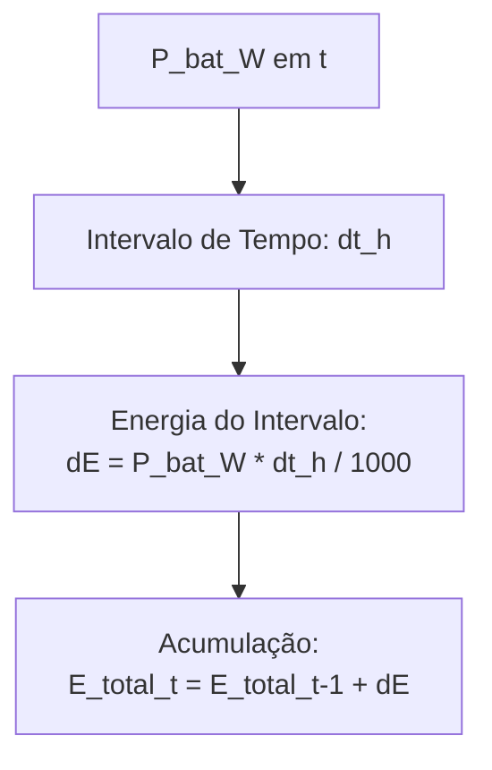

# Integração de Energia (Balanço de SOC)

Após todas as estratégias, o EMS calcula como isso afetou o nível de energia da bateria.

### Notas:
- **Carga Ajustada:** $P_{adj} = P_{load} + P_{bat}$
- **Balanço:** Energia Acumulada reflete a integração da potência ao longo do tempo.
