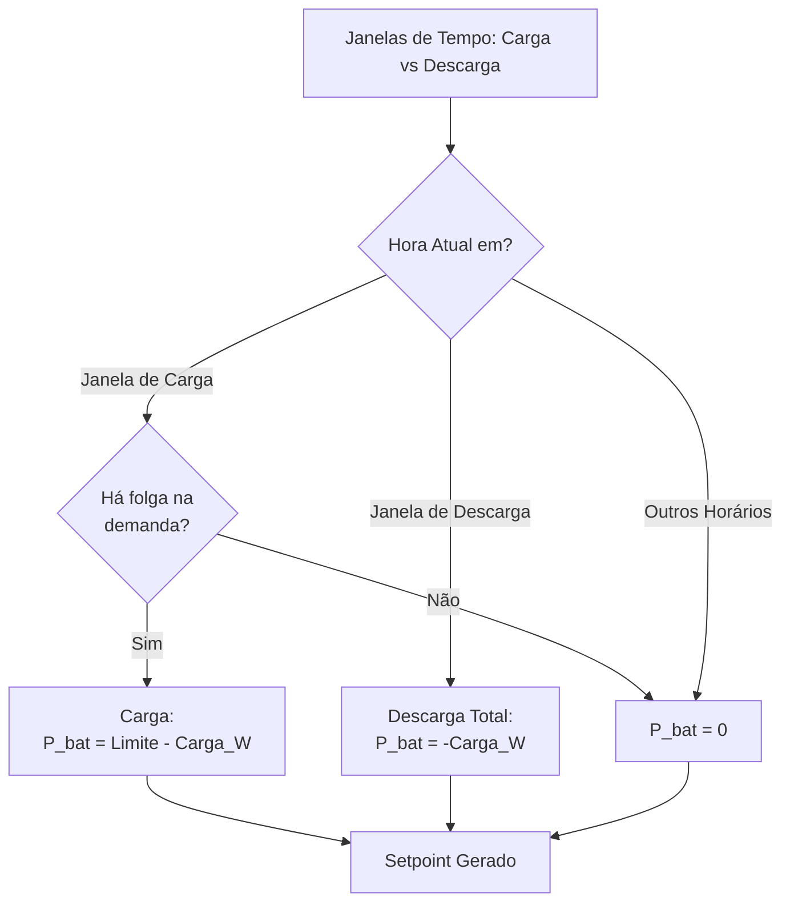

# Estratégia: Load Shifting (Arbitragem de Tempo)

Foca em carregar a bateria em horários baratos (fora de ponta) e descarregar em horários caros (ponta).

### Regras de Cálculo:
1. **Janela de Carga:** $P_{bat} = \max(0, Limite - P_{load})$
2. **Janela de Descarga:** $P_{bat} = -P_{load}$ (Cobre toda a carga se possível)
3. **Fora das Janelas:** $P_{bat} = 0$
