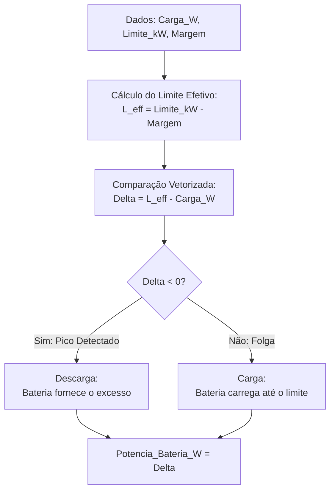

# Estratégia: Peak Shaving (Corte de Pico)

Esta estratégia visa manter a demanda da rede dentro de um limite contratado, utilizando a bateria para "achatar" os picos.

### Regras de Cálculo:
1. **Definição do Alvo:** $L_{eff} = L_{limit} - Margem$
2. **Diferença:** $\Delta P = L_{eff} - P_{load}$
3. **Ação:**
   - Se $\Delta P < 0$: Descarga.
   - Se $\Delta P > 0$: Carga.
