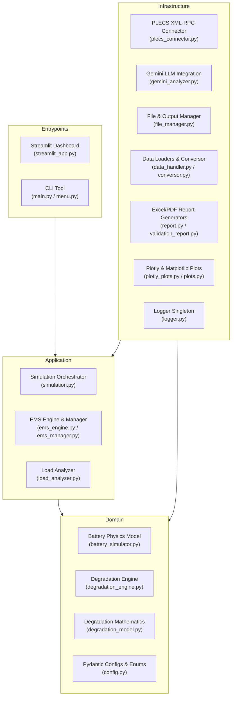

# Architecture

> Generated by /map on 2026-06-27

## Overview
BESx (Battery Energy Storage Simulator) is a high-fidelity simulation engine designed to model battery performance and degradation. It uses physical models (Coulomb Counting) and empirical degradation models (Stroe Model) to estimate battery life, remaining useful life (RUL), and state-of-health (SOH) under complex mission profiles. The project is structured using Clean Architecture principles, ensuring complete decoupling between calculation engines, user interfaces (CLI/Streamlit), and infrastructure components.

## System Diagram

## Components

### 1. Domain Layer
Core electro-chemical equations, state preservation, and fatigue counting.
- **Battery Simulator:** `src/besx/domain/models/battery_simulator.py`
  - Implements the Coulomb Counting algorithm for State of Charge (SOC) tracking.
  - Dynamically calculates terminal voltage ($V_{term}$) and cell current using charge/discharge OCV tables.
  - Optimized with **Numba JIT compilation** (`@jit(nopython=True)`) to allow high-frequency temporal simulations.
- **Degradation Engine:** `src/besx/domain/models/degradation_engine.py`
  - Acts as the state container and coordinator for incremental/monthly degradation.
  - Applies non-linear quadratic damage accumulation rules for cyclic degradation and fractional power laws for calendar degradation.
- **Degradation Model:** `src/besx/domain/models/degradation_model.py`
  - Implements mathematical equations for cycle degradation (Rainflow counting and Palmgren-Miner damage) and calendar degradation (Stroe empirical parameters).
  - Calculates operational statistics (`EstatisticasOperacionais`), the **Severity Factor** ($\sigma$) normalized against Serrão's reference cycle, and remaining useful life (RUL) projections using binary search projection.

### 2. Application Layer
Business rules and orchestration logic.
- **Simulation Manager:** `src/besx/application/simulation.py`
  - Orchestrates the monthly batch simulation process.
  - Implements **state checkpointing** (`checkpoint.json`) to resume interrupted simulations.
- **EMS Engine:** `src/besx/application/ems/`
  - `ems_engine.py`: Vectorized Energy Management System algorithms for Peak Shaving, Load Shifting, Power Factor correction, and combined dispatch.
  - `ems_manager.py`: Translates raw time-series data, handles power scaling (kW to W, Wh to W), and prepares profiles.
- **Load Analyzer:** `src/besx/application/analysis/load_analyzer.py`
  - Validates and pre-processes input load profiles for timeline consistency and data gaps.

### 3. Infrastructure Layer
Adapters for external systems, visualization, and logging.
- **PLECS Connector:** `src/besx/infrastructure/plecs/plecs_connector.py`
  - Communicates via XML-RPC (`ServerProxy`) to simulate battery systems inside PLECS (Scope export) or falls back to the native Python simulator if PLECS is offline.
- **LLM Integration:** `src/besx/infrastructure/llm/gemini_analyzer.py`
  - Integrates Google GenAI SDK (Gemini) to perform automated reports, diagnostic comments, and residual modeling checks.
- **Report & Validation Generators:** `src/besx/infrastructure/reports/`
  - Formats simulation outputs into standardized Excel spreadsheets (openpyxl) and PDF summaries.
- **Logging Singleton:** `src/besx/infrastructure/logging/logger.py`
  - Sets up centralized logging using `colorlog` with standard level formats.
- **File & Data Loaders:** `src/besx/infrastructure/files/` & `src/besx/infrastructure/loaders/`
  - Manage relative path resolutions and conversion of MATLAB (.mat) or CSV profiles.

### 4. Entrypoints
Access routes to the application.
- **Dashboard UI:** `src/besx/infrastructure/ui/streamlit/`
  - Multi-page Streamlit dashboard (`step_settings.py`, `step_simulation.py`, `step_results.py`, etc.).
  - Protected against Streamlit's top-down re-executions using `@st.cache_data` and strict `st.session_state` management.
- **CLI Mode:** `src/besx/entrypoints/cli/`
  - Headless command line interface for high-performance runs and automated cron integrations.

---

## Data Flow
1. **Input Loading:** The user inputs telemetry data via Streamlit or CLI. `LoadAnalyzer` checks time-step validity.
2. **EMS Dispatch:** `ems_engine` runs algorithms on the power profiles to obtain the net battery battery charge/discharge setpoints ($P_{bat}$).
3. **Electro-Thermal Simulation:** `BatterySimulator` uses Coulomb Counting and JIT-compiled arrays to estimate cell current, OCV, terminal voltage, and SOC time-series.
4. **Fatigue & Degradation:**
   - The Rainflow algorithm extracts SOC microcycles (DOD and Mean SOC) from peak-valley simplified SOC curves.
   - Cyclic damage ($C_{cyc}$) is computed for each extracted cycle and accumulated quadratically: $C_{cyc,tot} = \sqrt{C_{cyc,prev}^2 + C_{cyc,new}^2}$.
   - Idle periods are identified and calendar degradation ($C_{cal}$) is computed using Stroe empirical equations and accumulated via power law: $C_{cal,tot} = (C_{cal,prev}^p + C_{cal,new}^p)^{1/p}$.
5. **Output Compilation:** Results are stored, exported as Excel files via `validation_report.py`, analyzed by Gemini, and rendered in Streamlit.

---

## Conventions
- **Clean Architecture:** Strict boundaries. UI components never access domain models directly without going through the application layer.
- **Physical Decoupling:** Simulation engines must return pure DTOs (e.g. `DamageResult`) and are strictly isolated from any IO/Streamlit modules.
- **No Console Prints:** All stdout printing is forbidden in production code. Only import and use the global `logger` from `besx.infrastructure.logging.logger`.
- **Type Safety & Documentation:** Continuous enforcement of strict Type Hints and NumPy/Google docstring formats.
- **OS-Agnostic Paths:** No hardcoded absolute drive letters. All file operations utilize dynamic relative paths resolved via `Path(__file__)`.

---

## Technical Debt

### High Priority (Bugs)
- [ ] **ImportError in Unit Tests:** `tests/test_degradation_model.py` fails to import `acumular_dano` from `degradation_model.py`. The function was refactored/moved but the tests were not updated.
- [ ] **TypeError in Battery Simulation Tests:** `tests/test_battery_simulator.py` crashes because the test mock configuration `CFG_BAT_TESTE` lacks definitions for cell voltage limits (`Vbmin` / `Vbmax`), causing a TypeError when calculating `v_max_banco = cfg_bat.v_max_celula * cfg_bat.Ns`.

### Architectural / Performance Improvements
- [ ] **Incremental Rainflow:** The Rainflow algorithm currently runs on the entire monthly batch. It should be refactored to use an active-updating memory stack that processes cycle damage incrementally.
- [ ] **Pydantic Migration:** Complete the refactoring of legacy config dicts in `validation_report.py` to use strict validation models.
- [ ] **Dynamic Thermal Model:** Replace static cell temperatures with dynamic cell thermal estimation using Daniel/Rodrigo's thermal models.
