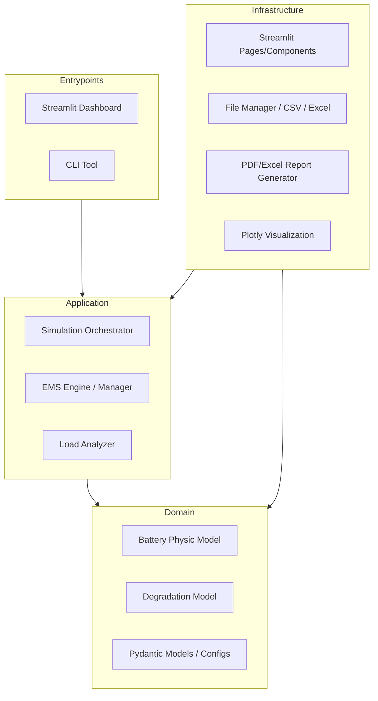

# Architecture

> Generated by /map on 2026-04-07

## Overview
BESx (Battery Energy Storage Simulator) is a high-fidelity simulation engine designed to model battery performance and degradation. It uses physical models (Coulomb Counting) and empirical degradation models (Stroe Model) to estimate battery life and state-of-health (SOH) under various mission profiles.

## System Diagram

## Components

### Domain Models
- **BatterySimulator:** Core logic for Coulomb Counting, SOC estimation, and power tracking.
- **DegradationModel:** Implements the Stroe model for cycle and calendar degradation, uses Rainflow Counting.
- **Location:** `src/besx/domain/models/`

### Application Layer
- **Simulation:** Orchestrates the simulation process, tying models with input data.
- **EMSEngine:** Handles Energy Management System logic for peak shaving, arbitrage, etc.
- **Location:** `src/besx/application/`

### Infrastructure / UI
- **Streamlit App:** Multi-page dashboard for configuration, simulation, and results analysis.
- **Location:** `src/besx/infrastructure/ui/streamlit/`

### Entrypoints
- **Dashboard:** `src/besx/entrypoints/dashboard/streamlit_app.py`
- **CLI:** `src/besx/entrypoints/cli/`

## Data Flow
1. **Input:** User uploads a Mission Profile (CSV/Excel) via the Streamlit UI.
2. **Preprocessing:** `LoadAnalyzer` cleans and validates the data.
3. **Simulation:** The `Simulation` orchestrator runs the mission profile through the `BatterySimulator`.
4. **Degradation:** `Rainflow` algorithm extracts cycles, and `DegradationModel` calculates SOH loss.
5. **Output:** Results are stored in `session_state` and visualized via `Plotly` or exported as reports.

## Conventions
- **Clean Architecture:** Strict separation between business logic (Domain) and presentation/IO (Infrastructure).
- **Strict Math:** 
    - Non-linear damage accumulation.
    - Rainflow cycle counting (Palmgren-Miner rule).
    - Severity Factor normalization.
- **Coding:** 
    - Strict Type Hints.
    - Google/NumPy docstring format.
    - No `print()` statements (use `logger`).
    - Pinned dependencies.

## Technical Debt
- [ ] Implement incremental Rainflow to improve performance in long simulations.
- [ ] Finalize intermediate calculation exports in `validation_report.py`.
- [ ] Standardize EMS input specifications (ongoing).
- [ ] Refactor remaining legacy dictionaries to Pydantic models.
