# 📚 Documentação Técnica — BESx (`src/besx`)

> **Battery Energy Storage Simulator** | Arquitetura em Camadas (Clean Architecture)

---

## Estrutura Geral

```
src/besx/
├── config.py                          ← Configurações globais (Pydantic)
├── application/                       ← Casos de Uso / Orquestração
│   ├── simulation.py                  ← Motor principal da simulação
│   ├── analysis/load_analyzer.py      ← Análise de perfil de carga
│   └── ems/
│       ├── ems_engine.py              ← Algoritmos EMS (Peak Shaving, Load Shifting)
│       └── ems_manager.py             ← Gerenciador e validador do EMS
├── domain/                            ← Regras de Negócio / Modelos Físicos
│   └── models/
│       ├── battery_simulator.py       ← Simulador de SOC (Coulomb Counting)
│       └── degradation_model.py       ← Modelo de degradação (Stroe + Rainflow)
├── entrypoints/                       ← Pontos de Entrada da Aplicação
│   ├── cli/
│   │   ├── main.py                    ← Entrypoint CLI
│   │   └── menu.py                    ← Menu interativo CLI
│   └── dashboard/
│       └── streamlit_app.py           ← Entrypoint do Dashboard Streamlit
└── infrastructure/                    ← Adaptadores / Serviços Externos
    ├── files/file_manager.py          ← Gerenciamento de pastas e arquivos
    ├── loaders/
    │   ├── conversor.py               ← Conversor CSV → Pickle
    │   └── data_handler.py            ← Carregamento e fatiamento de dados
    ├── logging/logger.py              ← Logger centralizado (colorlog)
    ├── plecs/plecs_connector.py       ← Adaptador PLECS XML-RPC / Backend Python
    ├── reports/
    │   ├── report.py                  ← Relatório TXT
    │   └── validation_report.py       ← Relatório de validação Excel
    ├── visualization/
    │   ├── plots.py                   ← Gráficos Matplotlib (estáticos)
    │   └── plotly_plots.py            ← Gráficos Plotly (interativos)
    ├── llm/gemini_analyzer.py         ← Integração com API Gemini
    └── ui/streamlit/
        ├── pages/                     ← Páginas do Wizard (Steps 1–6)
        └── utils/render_utils.py      ← Componentes visuais reutilizáveis
```

---

## 1. `config.py` — Configuração Global

**Responsabilidade:** Define todos os modelos de configuração usando Pydantic e expõe a instância global `CONFIGURACAO`. É a única fonte de verdade para constantes, parâmetros físicos e caminhos.

### Classes (Modelos Pydantic)

| Classe | Descrição |
|--------|-----------|
| `PlecsConfig` | Parâmetros do backend PLECS XML-RPC: nome do modelo, arquivos `.mat`/`.csv` de I/O, número de fases. |
| `DadosEntradaConfig` | Configurações dos dados de telemetria: nome do arquivo `.mat`, passo de tempo `dt_minutos`, dias/meses por período. |
| `SimulacaoConfig` | Escopo da simulação: `SOH_INICIAL_PERC` (%), `ANOS_SIMULACAO`, `MESES_SIMULACAO` e data de início. |
| `BateriaConfig` | Parâmetros físicos e nominais da bateria: química, capacidade (Wh), limites de SOC, curvas OCV, resistência interna (`Rs`), células em série/paralelo (`Ns`/`Np`), potência máxima (`P_bess`), rendimento do PCS. |
| `DegradacaoCicloConfig` | Constantes empíricas do modelo de degradação cíclica (Modelo de Stroe): coeficientes `a`, `b` (SOC), `c`, `d` (temperatura), `g`, `h` (DOD), expoente quadrático e parâmetros do Rainflow. |
| `DegradacaoCalendarioConfig` | Constantes do modelo de degradação calendária: `k_T`, `exp_T` (temperatura), `k_soc`, `exp_soc` (SOC), `exp_cal` (expoente de tempo). |
| `ModeloDegradacaoConfig` | Agregador das configurações de ciclo e calendário. |
| `PathsConfig` | Mapeamento de subpastas padrão: `data`, `sim`, `debug`, `plots`, `relatorio`. |
| `RelatorioConfig` | Flags para controle de detalhamento do relatório de validação. |
| `LLMConfig` | Configuração da integração com a API Gemini (lê `GEMINI_API_KEY` do ambiente). |
| `Settings` | **Root model** — agrega todos os submodelos acima. É a estrutura usada como `CONFIGURACAO` em todo o sistema. |

### Constantes e Variáveis Globais

| Constante | Tipo | Descrição |
|-----------|------|-----------|
| `PERFIL_ATIVO` | `str` | Nome do perfil de bateria ativo (chave de `PERFIS_BATERIA`). Atualizar aqui troca o perfil globalmente. |
| `CWD` | `Path` | Caminho do arquivo `config.py`. |
| `ROOT_DIR` | `Path` | Raiz do projeto (2 níveis acima de `config.py`). |
| `PATH_BATTERIES` | `Path` | Caminho para `resources/batteries.json`. |
| `PATH_DATABASE` | `Path` | Pasta `database/` na raiz do projeto. |
| `PATH_RESULTS` | `Path` | Pasta `results/` na raiz do projeto. |
| `PERFIS_BATERIA_RAW` | `dict` | JSON bruto lido de `batteries.json`. |
| `PERFIS_BATERIA` | `dict[str, BateriaConfig]` | Dicionário de perfis de bateria validados pelo Pydantic. |
| `CONFIGURACAO` | `Settings` | **Instância global de configuração** com o perfil ativo carregado. |

---

## 2. `application/simulation.py` — Gerenciador de Simulação

**Responsabilidade:** Orquestra todo o pipeline de simulação da bateria, iterando mês a mês, calculando danos e salvando resultados. É o "maestro" do sistema.

### Classe: `ResultadoMes` (Pydantic)

Modelo de dados para estruturar e validar o resultado de cada mês processado. Contém:
- Identificação: `mes`, `total_meses`
- Danos: `dano_ciclos_mes`, `dano_cal_mes`, `dano_ciclo_acum`, `dano_cal_acum`, `dano_total_acum`
- Estado da Bateria: `capacidade_restante`, `acum_energia_carga_kWh`, `acum_energia_descarga_kWh`
- Perfil amostrado: `df_soc_amostrado` (máx. 1000 pontos para não travar o Streamlit)
- Estatísticas: `Ciclos_Contagem`, `EFC_Ciclos_Equivalentes`, `DOD_Medio_Perc`, `C_Rate_Max`, `C_Rate_Medio`, `SOC_Medio`, `SOC_Medio_Idle`, `Tempo_SOC_Alto_Perc`, `Tempo_SOC_Baixo_Perc`, `Energia_Carga_kWh`, `Energia_Descarga_kWh`, `Rainflow_Cycles`

### Classe: `SimulationManager`

Gerenciador principal da simulação. Controla o estado global, processa mês a mês e persiste checkpoints.

#### `__init__(config, backend, data_file, on_mes_complete, sim_until_eol, resume_folder)`
Inicializa o gerenciador. Carrega perfil de bateria, cria o `FileManager`, inicializa variáveis de acumulação (`acum_ciclo_global`, `acum_cal_global`, etc.) e tenta retomar um checkpoint existente.

#### `_carregar_checkpoint() → None`
Lê `checkpoint.json` da pasta `data/` da simulação e restaura o estado (`soh_atual`, acumuladores, resultados mensais) para permitir retomada de uma simulação interrompida.

#### `_salvar_checkpoint() → None`
Serializa o estado atual (SOH, acumuladores, resultados mensais) para `checkpoint.json`. É chamado após cada mês processado.

#### `run() → None`
**Método principal.** Orquestra o pipeline completo:
1. Determina modo (EOL, meses personalizados ou anos)
2. Carrega e faria os dados via `data_handle()`
3. Itera mês a mês chamando `_processar_mes()`
4. Verifica critério de fim de vida (capacidade ≤ limite configurado)
5. Chama `_finalizar_simulacao()` ao término

#### `_processar_mes(df_mes, mes_id, total_meses) → None`
Processa um único mês de simulação. Executa sequencialmente:
1. Simula SOC via `run_monthly_simulation()` (backend Python ou PLECS)
2. Extrai SOC final para o próximo mês
3. Calcula **dano cíclico** via `picos_e_vales()` + `dano_ciclo()` com acumulação quadrática: `C_cyc_tot = √(C_cyc_ant² + C_cyc_mes²)`
4. Detecta períodos **idle** via `ciclos_idle()` e calcula **dano calendário** via `dano_calendar()` com acumulação exponencial: `C_cal_tot = (C_cal_ant^n + C_cal_mes^n)^(1/n)`
5. Atualiza SOH: `SOH = (SOH_inicial - C_ciclo_tot - C_cal_tot) / 100`
6. Calcula estatísticas operacionais via `calcular_estatisticas_operacionais()`
7. Faz downsampling do perfil SOC (máx. 1000 pontos) e monta o `ResultadoMes`
8. Aciona o callback `on_mes_complete` para atualização ao vivo no dashboard

#### `_finalizar_simulacao() → None`
Consolida e salva todos os resultados:
- Salva `.pkl` completo (preferido ao Excel por velocidade e suporte a tipos complexos)
- Salva snapshot de configuração em JSON
- Gera gráficos: evolução do SOH e composição de degradação (via `plots.py`)
- Gera relatório de validação Excel (se habilitado)
- Gera relatório de texto resumido

---

## 3. `application/analysis/load_analyzer.py` — Analisador de Carga

**Responsabilidade:** Análise estatística avançada de perfis de carga para dimensionamento de BESS.

### Dataclass: `LoadMetrics`
Estrutura de dados com todas as métricas calculadas:
- **Integridade:** `dt_min`, `duration_days`, `total_records`, `data_quality_score`
- **Potência:** `p_max_w`, `p_min_w`, `p_avg_w`, `p95_w`, `p90_w`, `load_factor`
- **Energia:** `total_energy_kwh`, `avg_daily_energy_kwh`, `est_monthly_energy_kwh`
- **Tarifário:** `p_max_ponta_w`, `energy_ponta_kwh`, `energy_fora_ponta_kwh`, `pct_energy_ponta`

### Classe: `LoadAnalyzer`

#### `__init__(df, time_col, load_col)`
Inicializa com o DataFrame, garante que a coluna de tempo é `datetime64` e ordena cronologicamente.

#### `analyze(peak_start_hour, peak_end_hour, holidays_list) → LoadMetrics`
Executa a análise completa em 4 etapas:
1. **Tempo:** Calcula `dt` mediano, duração em dias e alerta se < 24h
2. **Potência:** Calcula Pmax, Pmin, Pavg, P90, P95 e Fator de Carga
3. **Energia:** Integração trapezoidal: `Σ(W × (dt_min/60)) / 1000` → kWh
4. **Tarifário:** Aplica máscara de dia útil + não-feriado + janela horária (ponta vs. fora ponta), calculando energia e demanda máxima em cada período

---

## 4. `application/ems/ems_engine.py` — Motor EMS

**Responsabilidade:** Implementa algoritmos de despacho da bateria de forma puramente vetorizada e agnóstica às restrições físicas reais.

### Classe: `BessEMS`

#### `__init__()`
Inicializa o gerador de perfis (sem parâmetros de bateria).

#### `gerar_perfil_load_shifting(df_carga, hora_inicio_carga, hora_fim_carga, hora_inicio_descarga, hora_fim_descarga, limite_demanda_kw, ignorar_fins_de_semana, feriados, coluna_tempo, coluna_carga) → pd.DataFrame`
Implementa a estratégia de **Load Shifting (Arbitragem)** de forma vetorizada:
- **Carga (positivo):** Nas janelas de carga (horas de baixa tarifa), carrega o que sobrar abaixo do `limite_demanda_kw`
- **Descarga (negativo):** Nas janelas de descarga, descarrega toda a carga do momento
- Aplica filtragem de fins de semana e feriados antes de qualquer despacho
- Retorna DataFrame com `[Tempo, Potencia_Bateria_W]`

#### `gerar_perfil_peak_shaving(df_carga, limite_demanda_kw, faixa_seguranca_kw, faixa_seguranca_pct, coluna_tempo, coluna_carga) → pd.DataFrame`
Implementa a estratégia de **Peak Shaving (Corte de Pico)** de forma vetorizada:
- Calcula `limite_efetivo = limite_demanda_kw - faixa_seguranca_kw - (limite × faixa_pct/100)`
- `Potencia_Bateria_W = limite_efetivo_w - carga_w` (negativo no pico, positivo nos vales)
- Retorna DataFrame com `[Tempo, Potencia_Bateria_W]`

---

## 5. `application/ems/ems_manager.py` — Gerenciador EMS

**Responsabilidade:** Valida os dados de entrada e orquestra a execução sequencial de múltiplas estratégias EMS via padrão Strategy.

### Classe Abstrata: `BaseStrategy`

Interface para estratégias EMS. Define o contrato `execute(df_carga, bess_ems, **kwargs) → pd.DataFrame`.

### Classe: `LoadShiftingStrategy(BaseStrategy)`

Wrapper da estratégia Load Shifting. `execute()` repassa os kwargs para `bess_ems.gerar_perfil_load_shifting()`.

### Classe: `PeakShavingStrategy(BaseStrategy)`

Wrapper da estratégia Peak Shaving. `execute()` repassa os kwargs para `bess_ems.gerar_perfil_peak_shaving()`.

### Classe: `EMSManager`

#### `__init__(strategies, p_bess_max_w, capacidade_nominal_wh)`
Inicializa com lista de estratégias, limites de potência e capacidade, e instancia internamente o `BessEMS`.

#### `validate_and_prepare_input(df, time_col, load_col) → pd.DataFrame`
Validação rigorosa seguindo os requisitos REQ-04 a REQ-08:
- **REQ-04:** Parse de datetime
- **REQ-05:** Rejeita colunas não numéricas
- **REQ-06:** Rejeita valores NaN explicitamente (sem interpolação silenciosa)
- **REQ-07:** Valida uniformidade do `dt` (tolerância ±5%)
- **REQ-08:** Heurística para detectar e converter colunas em kWh para kW; padroniza `Carga_W`

#### `run(df_carga, time_col, load_col, soc_inicial, **kwargs) → pd.DataFrame`
Pipeline completo do EMS:
1. Valida/padroniza os dados
2. Executa cada estratégia sequencialmente, mergeando `Potencia_Bateria_W`
3. Integra energia acumulada: `Energia_kWh[t] = Energia_kWh[t-1] + (P_W × dt_h / 1000)`
4. Calcula `Carga_Ajustada_W = Carga_W + Potencia_Bateria_W`
5. Classifica status: `CHARGE` / `DISCHARGE` / `IDLE`

---

## 6. `domain/models/battery_simulator.py` — Simulador de SOC

**Responsabilidade:** Simulação física da bateria via integração de Coulomb e Modelo Rint. Substitui o PLECS quando `backend="python"`.

### Função: `_interpolar_ocv(soc_frac, soc_prof, ocv_prof) → float`
Interpola linearmente a tensão OCV do banco de células para um dado SOC (fração 0–1) usando `np.interp`.

### Função: `simular_soc_mes(df_mes, soh_atual, soc_inicial, cfg_bat) → pd.DataFrame`
**Simulador principal.** Implementa a integração de Coulomb passo a passo com Modelo Rint:

**Fluxo por passo de tempo `k`:**
1. Determina `dt_h` (delta tempo em horas)
2. Limita P_CA ao limite do PCS (`P_bess`)
3. Seleciona curva OCV ativa (com histerese: carga vs. descarga)
4. Interpola `V_ocv` da curva ativa
5. Aplica rendimento do PCS para obter `P_dc`
6. Resolve equação quadrática do circuito Rint: `rs×I² + V_ocv×I - P_dc = 0`
   - `I = (-V_ocv + √(V_ocv² + 4×rs×P_dc)) / (2×rs)`
   - Para `rs=0`: `I = P_dc / V_ocv`
7. Verifica limites de tensão (BMS cut-off): limita corrente a `(V_max - V_ocv) / rs`
8. Realiza Coulomb Counting: `ΔSOC = (I_cel × dt_h) / Q_efetivo`
9. Clipa SOC nos limites operacionais `[soc_min, soc_max]`
10. Registra corrente, tensão e P_CA real

**Retorna** DataFrame com `['Tempo', 'SOC', 'Corrente_A', 'Tensao_Term_V', 'Potencia_CA_kW']`.

### Função: `old_simular_soc_mes(...)` *(legado)*
Versão anterior simplificada do simulador (sem BMS cut-off, sem Corrente/Tensão na saída). Mantido para referência futura. Possui um bug conhecido: referencia `soc_pct` antes de ser definida.

### Função: `picos_e_vales(profile_series, prominence) → np.ndarray`
Extrai picos e vales significativos de uma série de SOC usando `scipy.signal.find_peaks` com `prominence`. Mantém sempre o primeiro e último ponto. Reduz drasticamente o número de pontos para otimizar o Rainflow.

### Função: `ciclos_idle(profile, dt_minutos_soc, minutos_por_mes) → list[dict]`
Detecta períodos de repouso (SOC constante) no perfil. Para cada período, calcula:
- `t`: número de amostras consecutivas com SOC constante
- `t_meses`: duração em meses (normalizada)
- `SOC`: valor do SOC durante o repouso
- `index`: posição no perfil

---

## 7. `domain/models/degradation_model.py` — Modelo de Degradação

**Responsabilidade:** Implementa o modelo empírico de degradação de Stroe com Rainflow Cycle Counting (cíclico + calendário).

### Classe: `EstatisticasOperacionais` (Pydantic)
DTO com estatísticas operacionais mensais: ciclos Rainflow, EFC, DOD médio, C-Rates, SOC médio (geral e em repouso), tempos em SOC alto/baixo, energias de carga/descarga.

### Função: `acumular_dano(Ccal_total_mes, acum_cal_global, exp_tempo) → float`
Acumula dano com a lei de potência: `D_total = (D_mes^n + D_acum^n)^(1/n)`.

### Função: `calcular_dano_referencia_serrao(model_params) → float`
Calcula o dano nominal de referência (ponto de calibração) segundo Serrão et al.:
- **Referência:** T=25°C, SOC=50%, DOD=10%, 30 ciclos/mês
- Combina dano cíclico (30 ciclos × dano unitário com acumulação quadrática) + dano calendário de 1 mês

### Função: `calcular_fator_severidade(dano_total_mes, model_params) → float`
Calcula o Fator de Severidade (Is): `Is = dano_real / dano_nominal`. Permite comparar o quão mais severo é o perfil real vs. o perfil de referência de laboratório.

### Função: `calcular_rul(soh_atual_perc, dano_total_acumulado, meses_simulados, dias_por_ano_avg) → float`
Projeta o **Remaining Useful Life (RUL)** em anos:
- Extrapola a taxa de dano diária: `dano_diário = dano_total / dias_simulados`
- `RUL = (SOH_atual - 80%) / dano_anual`

### Função: `dano_ciclo(lista_ciclos, Temp_kelvin, model_params) → tuple[float, pd.DataFrame]`
Calcula o dano cíclico total do mês usando **Rainflow Cycle Counting**:
1. Reduz o perfil via `picos_e_vales()` para otimizar o Rainflow
2. Extrai ciclos com `rainflow.extract_cycles()`
3. Para cada ciclo `(DOD, SOC_médio)`, calcula o **dano unitário** via modelo de Stroe:
   - `CF_soc = a × exp(b × SOC × 100)`
   - `CF_temp = c × exp(d × T_K)`
   - `CF_depth = g × (DOD × 100)^h`
   - `dano = CF_depth × CF_soc × CF_temp`
4. Acumula quadraticamente: `C_cyc = √(C_cyc² + dano²)`
5. Retorna `(C_cyc_total, df_detalhado_com_intermediarios)`

### Função: `dano_calendar(lista_periodos_idle, Tbat_kelvin, model_params, dt_minutos, dias_por_ano_avg) → tuple[float, pd.DataFrame]`
Calcula o dano calendário total do mês para cada período de repouso:
1. Para cada período idle `{SOC, t_meses}`:
   - `CCal_temp = k_T × exp(exp_T × T_K)`
   - `CCal_soc = k_soc × exp(exp_soc × SOC × 100)`
   - `CCal_time = t_meses^exp_cal`
   - `dano = CCal_temp × CCal_soc × CCal_time`
2. Acumula com lei de potência: `C_cal = (C_cal^n + dano^n)^(1/n)`
3. Retorna `(C_cal_total, df_detalhado_com_intermediarios)`

### Função: `calcular_estatisticas_operacionais(df_soc_saida, df_potencia_entrada, cap_kwh, lista_periodos_idle) → EstatisticasOperacionais`
Analisa o resultado mensal completo:
1. **Energia:** Integra P_CA positiva (carga) e negativa (descarga) por `dt_h`
2. **C-Rate:** `C-Rate = |P_CA_kW| / cap_kwh`
3. **Rainflow:** Extrai ciclos do SOC simplificado via `picos_e_vales()`
4. **EFC:** `Σ(DOD × count)` para cada ciclo Rainflow
5. **SOC médio em repouso:** Média ponderada pelo tempo de cada período idle

---

## 8. `infrastructure/files/file_manager.py` — Gerenciador de Arquivos

**Responsabilidade:** Cria e organiza a estrutura de pastas para cada simulação, baseada em timestamp.

### Classe: `FileManager`

#### `__init__(base_path, resume_folder)`
Cria a pasta da simulação: `results/sim_YYYYMMDD_HHMMSS/` (ou reutiliza uma existente se `resume_folder` for fornecido). Cria subpastas `plots/`, `debug/`, `data/`.

#### `_create_structure() → None`
Cria todas as subpastas com `os.makedirs(..., exist_ok=True)`.

#### `get_debug_path(filename) → str`
Retorna o caminho completo para um arquivo na pasta `debug/`.

#### `get_plot_path(filename) → str`
Retorna o caminho completo para um arquivo na pasta `plots/`.

#### `get_data_path(filename) → str`
Retorna o caminho completo para um arquivo na pasta `data/` (usada para `.pkl`, `.json` e checkpoints).

#### `save_report(content, filename) → str`
Salva um conteúdo texto na raiz da pasta da simulação e retorna o caminho.

---

## 9. `infrastructure/loaders/conversor.py` — Conversor de Dados

**Responsabilidade:** Converte arquivos CSV (padrão BR) para Pickle otimizado.

### Função: `converter_csv_para_pkl(csv_path, pkl_path) → None`
Lê um CSV com delimitador `;` e decimal `,` (padrão Excel brasileiro), padroniza os nomes das colunas para `['Tempo', 'Potencia_kW']` e salva como Pickle (muito mais rápido para leitura posterior com Pandas).

---

## 10. `infrastructure/loaders/data_handler.py` — Handler de Dados

**Responsabilidade:** Orquestra o carregamento, análise e fatiamento dos dados de entrada de telemetria.

### Função: `data_handle(nome_arquivo, meses_alvo, file_manager) → list[pd.DataFrame]`
**Função principal.** Orquestra o pipeline completo em 6 etapas:
1. Seleciona arquivo (interativo ou por argumento)
2. Identifica/converte o tipo (`.mat`, `.pkl`, `.csv`)
3. Carrega os dados em DataFrame
4. Analisa integridade e determina `dt_minutos`
5. Ajusta duração (corta ou expande ciclicamente)
6. Fatia em meses e retorna lista de DataFrames

### Função: `selecionar_arquivo_database() → Optional[str]`
Lista os arquivos em `PATH_DATABASE` e promove interação via `input()` para o usuário escolher. Usada no modo CLI interativo.

### Função: `identificar_tipo_arquivo(nome_arquivo_selecionado) → Optional[str]`
Analisa a extensão e, se CSV, converte para Pickle. Retorna o nome do arquivo final (`.mat` ou `.pkl`). Atualiza `CONFIGURACAO.dados_entrada.ARQUIVO_MAT`.

### Função: `carregar_dados_mat(filename) → Optional[pd.DataFrame]`
Carrega o arquivo de dados:
- **`.pkl`:** Lê via `pd.read_pickle()`, padroniza colunas para `['Tempo', 'Potencia_kW']`
- **`.mat`:** Lê via `scipy.io.loadmat()`, extrai a primeira variável e constrói DataFrame `['Tempo', 'Potencia_kW']`

### Função: `analisar_integridade_dados(df) → Optional[float]`
Analisa e reporta via logger:
1. Detecta `dt_minutos` via moda das diferenças temporais
2. Verifica constância do passo de tempo (alerta em caso de jitter)
3. Calcula cobertura temporal e total de meses
4. Verifica valores nulos
5. Reporta estatísticas (máx., mín., média)

### Função: `ajustar_duracao_dados(df, dt_minutos, meses_alvo, interativo) → pd.DataFrame`
Expande ou corta os dados para atingir a duração desejada:
- **Cortar:** `df.iloc[:linhas_alvo]`
- **Expandir:** `np.tile(valores_potencia, repeticoes)` + reconstrução do vetor de tempo (`np.arange`)
- Aceita entrada interativa (CLI) ou argumento direto (`meses_alvo`, Dashboard)

### Função: `fatiar_dados_mensais(df) → list[pd.DataFrame]`
Divide o DataFrame em sublistas mensais (base 30 dias). Reseta o tempo de cada mês para `t=0`. Descarta meses com menos de 20% da duração esperada.

---

## 11. `infrastructure/logging/logger.py` — Logger Centralizado

**Responsabilidade:** Configura e expõe o logger singleton do projeto.

### Função: `setup_logger() → logging.Logger`
Configura um logger named `"BESx"` com:
- Handler de console (`stdout`) com nível `INFO`
- Formatter colorido via `colorlog` (DEBUG=cyan, INFO=green, WARNING=yellow, ERROR=red)
- Guard contra handlers duplicados (idempotente)

**Exporta:** `logger` — instância singleton usada por todos os módulos do projeto.

---

## 12. `infrastructure/plecs/plecs_connector.py` — Adaptador de Backend

**Responsabilidade:** Fornece a interface unificada `run_monthly_simulation()` que roteia para o backend Python ou PLECS conforme configuração.

### Função (Pública): `run_monthly_simulation(df_mes, soh_atual, SOC_0, ctt, config, backend) → pd.DataFrame`
Ponto de entrada único para simular um mês. Roteia:
- `backend="python"` → `_run_python()` (não requer PLECS)
- `backend="plecs"` → `_run_plecs()` (requer servidor PLECS em `localhost:1080`)

### Função (Pública): `extrair_soc_final(df_soc) → float`
Extrai o SOC final (último passo de tempo, ordenado) como fração 0–1. Valida se está no intervalo físico `[0, 1]`.

### Função (Pública): `close_plecs_server() → None`
Tenta enviar o comando `plecs.quit()` via XML-RPC. Silencioso se o servidor não estiver ativo.

### Função (Privada): `_run_python(df_mes, soh_atual, SOC_0, ctt, config) → pd.DataFrame`
1. Realiza **upsampling para 1 minuto** por interpolação linear (`np.interp`) para melhorar a precisão da integração
2. Delega para `simular_soc_mes()` do `battery_simulator.py`

### Função (Privada): `_run_plecs(df_mes, soh_atual, SOC_0, ctt, config) → pd.DataFrame`
1. Prepara arquivo `.mat` com o perfil de potência normalizado (t=0, unidade em Watts)
2. Monta `ModelVars` via `_montar_model_vars_bateria()`
3. Executa simulação via `plecs_server.plecs.simulate()`
4. Lê CSV de saída (`dadosnovos.csv`), renomeia colunas, converte SOC de `%` para fração

### Função (Privada): `_to_native_types(data) → Any`
Converte tipos NumPy (`np.int64`, `np.float32`, `np.ndarray`) para tipos Python nativos. Necessário pois XML-RPC não suporta objetos NumPy.

### Função (Privada): `_montar_model_vars_bateria(cfg_bat, soc_inicial, soh_atual) → dict`
Constrói o dicionário `ModelVars` para o PLECS: `SOC_0`, `SOH_Input`, `Rs`, `Ah`, `Ns`, `Np`, curvas OCV, limites de SOC/tensão, potência máxima e rendimento.

---

## 13. `infrastructure/reports/report.py` — Relatório Textual

**Responsabilidade:** Gera um relatório `.txt` legível com resumo da simulação.

### Função: `gerar_relatorio_txt(file_manager, config, df_res, sim_duration_str, prefixo) → str`
Gera relatório com 3 seções:
1. **Configuração (Snapshot):** Arquivo de entrada, passo de tempo, parâmetros da bateria e do modelo de degradação
2. **Estatísticas Operacionais:** Médias de SOC, C-Rate, DOD, tempos em SOC extremo
3. **Resultados de Degradação:** SOH inicial/final, perdas por ciclagem e calendário, ciclos Rainflow, EFC e estimativa de vida útil linear

---

## 14. `infrastructure/reports/validation_report.py` — Relatório de Validação

**Responsabilidade:** Gera relatório Excel detalhado com todos os cálculos intermediários para rastreabilidade científica.

### Função: `gerar_relatorio_validacao(file_manager, config, resultados_mensais, calculos_detalhados, prefixo) → str`
Orquestra a criação do Excel completo:
1. Chama `criar_sheet_configuracao()`
2. Chama `criar_sheet_resumo_mensal()`
3. Chama `criar_sheets_calculos_detalhados()`
4. Aplica `formatar_workbook()` ao final

### Função: `criar_sheet_configuracao(writer, config) → None`
Cria aba `Configuracao` com todos os parâmetros em formato `[Parâmetro, Valor]`, agrupados por seção (simulação, bateria, degradação ciclo, degradação calendário).

### Função: `criar_sheet_resumo_mensal(writer, df_resultados) → None`
Cria aba `Resumo_Mensal` com o DataFrame consolidado de resultados mensais.

### Função: `criar_sheets_calculos_detalhados(writer, calculos_detalhados) → None`
Cria uma aba `Mes_N_Ciclo` e uma aba `Mes_N_Calendario` para cada mês, contendo todos os cálculos intermediários (coeficientes, danos parciais, fatores).

### Função: `formatar_workbook(caminho_excel) → None`
Aplica formatação profissional: cabeçalho azul com texto branco, largura de coluna automática e congelamento da primeira linha.

### Função: `exportar_debug_degradacao(dados, etapa, mes_id, sufixo, pasta_debug) → str`
Exporta dados intermediários (DataFrame, Series, lista ou array) para Excel na pasta `debug/`. Usado para auditoria passo a passo do modelo de degradação.

### Função: `export_xlsx(df_list, filename) → None`
Exporta uma lista de DataFrames para um único arquivo Excel com múltiplas abas (`Sheet_1`, `Sheet_2`, ...).

---

## 15. `infrastructure/visualization/plots.py` — Gráficos Estáticos (Matplotlib)

**Responsabilidade:** Gera imagens PNG estáticas para relatórios e arquivos de saída.

### Função: `plotar_capacidade_mensal(df_resultados, nome_arquivo_saida) → None`
Gera gráfico de linha da evolução do SOH ao longo dos meses, com linha horizontal vermelha tracejada indicando o limite de fim de vida (EOL). Salva em PNG com DPI 150.

### Função: `plotar_composicao_degradacao(df_resultados, nome_arquivo_saida) → None`
Gera gráfico de área empilhada (Degradação Cíclica + Calendário) com uma linha tracejada preta para a perda total acumulada. Salva em PNG com DPI 150.

---

## 16. `infrastructure/visualization/plotly_plots.py` — Gráficos Interativos (Plotly)

**Responsabilidade:** Gera gráficos interativos para o dashboard Streamlit, com tema escuro.

### Função: `plot_ems_dispatch_comparison(df, time_col, limite_w) → go.Figure`
Comparativo de despacho EMS: Carga Original vs. Carga Ajustada vs. Potência da Bateria. Adiciona linha de referência para o limite de demanda.

### Função: `plot_energy_balance(df, time_col) → go.Figure`
Balanço de energia acumulado em kWh ao longo do tempo. Ajuda o usuário a dimensionar a capacidade da bateria.

### Função: `plot_load_duration_curve(df, load_col) → go.Figure`
Curva de Permanência de Carga (Load Duration Curve): potência ordenada de forma decrescente com eixo X em percentagem de tempo.

### Função: `plot_load_heatmap(df, time_col, load_col) → go.Figure`
Heatmap de consumo médio por hora do dia × dia da semana. Identifica padrões operacionais (turnos, fins de semana).

### Função: `plot_peak_analysis(energy_ponta_kwh, energy_fora_ponta_kwh) → go.Figure`
Gráfico de barras comparativo entre energia consumida na ponta e fora de ponta.

---

## 17. `infrastructure/llm/gemini_analyzer.py` — Integração LLM

**Responsabilidade:** Envia dados de comparação de simulações para a API Gemini e retorna análise técnica em Markdown.

### Função: `analisar_comparacao_bess(dados_simulacoes, api_key) → str`
1. Valida a chave API (da configuração ou do argumento)
2. Serializa os KPIs das simulações em JSON
3. Monta um prompt estruturado com persona de Engenheiro BESS, contexto do modelo de Stroe/Rainflow, e 3 objetivos: análise comparativa, "reality check" (alertas de limitação do modelo), e recomendações PIML
4. Chama `gemini-2.5-flash` via SDK `google-genai`
5. Retorna a resposta em Markdown ou mensagem de erro formatada

---

## 18. Entrypoints

### `entrypoints/cli/main.py` — CLI Principal

#### Função: `parse_args() → argparse.Namespace`
Configura os argumentos CLI: `--perfil`, `--backend`, `--resume`.

**Fluxo `__main__`:**
1. Parseia argumentos
2. Se `--perfil` e `--backend` fornecidos: usa diretamente
3. Caso contrário: exibe menu interativo `exibir_menu_inicial()`
4. Atualiza `CONFIGURACAO.bateria` com o perfil escolhido
5. Instancia e executa `SimulationManager`

---

### `entrypoints/cli/menu.py` — Menu Interativo CLI

**Constantes:** `BACKEND_PLECS`, `BACKEND_PYTHON`, `_BACKENDS_DISPONIVEIS`, `_DESCRICOES_BACKEND`

#### Função: `exibir_menu_inicial() → tuple[str, str]`
Loop interativo que exibe cabeçalho, pede perfil de bateria, pede backend e pede confirmação. Retorna `(perfil_ativo, backend)`.

#### Função: `_imprimir_cabecalho() → None`
Exibe cabeçalho ASCII do BESx no console.

#### Função: `_selecionar_perfil_bateria() → str`
Lista os perfis de `PERFIS_BATERIA` com detalhes (Ah, Ns×Np, kW, kWh) e solicita escolha por número.

#### Função: `_selecionar_backend() → str`
Lista os backends disponíveis e solicita escolha.

#### Função: `_confirmar_selecao(perfil_ativo, backend) → bool`
Exibe resumo da configuração selecionada e pede confirmação. Retorna `True` se confirmado.

---

### `entrypoints/dashboard/streamlit_app.py` — Dashboard Streamlit

**Responsabilidade:** Ponto de entrada do Streamlit. Configura a página, navbar e despacha para os steps.

#### Função: `change_step(new_step)`
Callback de navegação que atualiza `st.session_state.nav_step`.

**Estrutura:**
- **Configuração:** `st.set_page_config()`, CSS global (glassmorphism, animações de hover)
- **Session State:** Inicializa `nav_step`, `sim_results`, `sim_status`, `config_override`, `ems_injected`
- **Sidebar:** Botões de navegação estilizados como Cards com glow CSS dinâmico para o card ativo
- **Dispatcher:** Rota o step ativo para `render_step_rules()`, `render_step_battery()`, `render_step_simulation()`, `render_step_results()`, `render_step_comparison()` ou `render_step_settings()`

---

## 19. `infrastructure/ui/streamlit/pages/step_simulation.py` — Passo 3 (UI de Simulação)

**Responsabilidade:** Interface do usuário para configurar e executar a simulação física.

### Função: `render_step_simulation()`
**Componentes UI:**
- Seletor de backend (Python/PLECS), com detecção automática se está na nuvem
- Seletor de duração (Anos ou Meses via slider)
- Toggle para modo EOL (simular até 80% SOH)
- Selectbox para escolher arquivo da base de dados (prioriza o EMS injetado no Step 1)
- Barra de progresso e métricas ao vivo via `live_callback`

**Callback `live_callback(df_soc, res_mes, df_in)`:**
- Atualiza `st.session_state.sim_results` com o resultado do mês
- Atualiza barra de progresso e mensagem de status
- Exibe `render_glass_battery()` com o SOH atual
- Calcula e exibe velocidade da simulação (meses/s) e ETA estimado

**Execução via `st.button("🚀 INICIAR")`:**
- Monta configuração com parâmetros do Step 2 (bateria, temperaturas, SOC min/max)
- Desativa logs detalhados para máxima velocidade durante a UI
- Instancia `SimulationManager` e chama `sim.run()`
- Em caso de sucesso: `st.balloons()` e navega para resultados

---

## 20. `infrastructure/ui/streamlit/utils/render_utils.py` — Utilitários de Renderização

**Responsabilidade:** Componentes visuais reutilizáveis e funções de renderização de métricas/gráficos.

**Constante:** `THEME_COLORS` — Paleta neon do dashboard (PRIMARY cyan, SECONDARY violeta, SUCCESS verde, DANGER vermelho, CYCLE azul, CALENDAR rosa).

### Função: `get_status_color(value) → str`
Retorna cor baseada no valor de SOH: verde (>95%), amarelo (>85%), vermelho (≤85%).

### Função: `render_glass_battery(soh, label) → None`
Renderiza bateria estilo Glassmorphism (vidro fosco + glow neon) via HTML/CSS. O nível de preenchimento reflete o SOH.

### Função: `render_ev_battery(soh, label) → None`
Renderiza bateria estilo EV Dashboard (10 segmentos verticais filtrando por opacidade). Alternativa visual ao glass battery.

### Função: `format_sim_name(sim_id) → str`
Lê o `config_snapshot*.json` de uma pasta de simulação e formata o nome legível: `[BACKEND] BateriaX | N meses | DD/MM/YYYY HH:MM:SS`.

### Função: `render_metrics_row(df_results, throughput_mwh, energy_charge, energy_discharge, month_idx) → None`
Renderiza 8 métricas em 2 linhas de 4 colunas: bateria EV, SOH, Fator de Severidade (Is), RUL, Throughput, Carga, Descarga e EFC. Suporta exibição por mês específico ou final.

### Função: `render_view_overview(df_results, df_soc_mes, month_idx, key_suffix) → None`
Renderiza a aba "Visão Geral": curva de SOC mensal (esquerda) + evolução do SOH ou razão de danoempilhada (direita).

### Função: `render_view_degradation(df_results, month_idx, key_suffix) → None`
Renderiza a aba "Degradação": DOD médio (barras), composição de degradação (pie chart), histograma de DOD Rainflow e Matriz de Fadiga (scatter DOD × SOC médio, tamanho = count).

### Função: `render_view_operational(df_results, df_soc_mes, df_input_mes, month_idx, key_suffix) → None`
Renderiza a aba "Operacional": série temporal com 4 subplots (Tensão, Corrente, Potência CA, SOC) para um mês selecionado, com downsampling inteligente para máx. 1500 pontos.

---

## 🔄 Fluxograma — Execução de uma Simulação de Bateria

```mermaid
flowchart TD
    A([🚀 Início]) --> B{Entrypoint}
    B -->|CLI| C[main.py\nparse_args]
    B -->|Dashboard| D[streamlit_app.py\nStep 3 Button Click]

    C --> E[menu.py\nexibir_menu_inicial\nPerfil + Backend]
    D --> F[step_simulation.py\nMonta cfg com Step 2\nPerfil + Backend + Arquivo]

    E --> G[SimulationManager.__init__\nInitializa acumuladores\nCarrega checkpoint se houver]
    F --> G

    G --> H[SimulationManager.run\nDetermina meses_alvo\nModo: anos / meses / EOL]

    H --> I[data_handle\nCarrega + fatia dados]

    I --> J[selecionar_arquivo_database\nou usa nome_arquivo]
    J --> K[identificar_tipo_arquivo\nCSV → PKL / MAT / PKL]
    K --> L[carregar_dados_mat\nScipy loadmat ou read_pickle]
    L --> M[analisar_integridade_dados\ndt_minutos, nulos, cobertura]
    M --> N[ajustar_duracao_dados\nCorta ou expande ciclicamente]
    N --> O[fatiar_dados_mensais\nLista de DataFrames mensais]

    O --> P{Loop: Para cada mês}

    P --> Q[_processar_mes\ndf_mes, mes_id, total_meses]

    subgraph SIM ["🔋 Simulação Física — ETAPA 1"]
        Q --> R[run_monthly_simulation\nroteador de backend]
        R -->|backend=python| S[_run_python\nUpsampling 1min]
        R -->|backend=plecs| T[_run_plecs\nSalva .mat\nXML-RPC simulate\nLê dadosnovos.csv]
        S --> U[simular_soc_mes\nCoulomb Counting + Rint\nSOC, V, I, P_CA por passo]
        T --> V[DataFrame PLECS\nTempo, SOC, Corrente_A\nTensao_Term_V]
        U --> W[DataFrame Python\nTempo, SOC, Corrente_A\nTensao_Term_V, Potencia_CA_kW]
    end

    W --> X[extrair_soc_final\nSOC_0 do próximo mês]
    V --> X

    subgraph DEG_CYC ["⚡ Degradação Cíclica — ETAPA 2"]
        X --> Y[picos_e_vales\nscipy find_peaks\nReducão da série]
        Y --> Z[dano_ciclo\nrainflow.extract_cycles\nPara cada ciclo:\nCF_soc × CF_temp × CF_depth\nAcumula quadraticamente\nC_cyc_mes = √Σdano²]
        Z --> AA[C_cyc_global = √C_cyc_ant² + C_cyc_mes²\nAcumulação quadrática entre meses]
    end

    subgraph DEG_CAL ["🕐 Degradação Calendária — ETAPA 3"]
        AA --> AB[ciclos_idle\nDetecta períodos SOC constante\nt_meses para cada período]
        AB --> AC[dano_calendar\nPara cada período idle:\nCCal_T × CCal_SOC × CCal_time\nAcumula exponencialmente\nC_cal_mes = Σdano^n]
        AC --> AD[C_cal_global = C_cal_ant^n + C_cal_mes^n ^1/n\nAcumulação de potência entre meses]
    end

    subgraph SOH_UPDATE ["📊 Atualização do SOH — ETAPA 4"]
        AD --> AE[perda_total = C_cyc_global + C_cal_global\nsoh_atual = SOH_inicial - perda_total / 100]
    end

    subgraph STATS ["📈 Estatísticas — ETAPA 5"]
        AE --> AF[calcular_estatisticas_operacionais\nEFC via Rainflow\nC-Rate máx/médio\nDOD médio\nSOC médio geral e idle\nTempos em SOC extremo\nEnergias carga/descarga]
    end

    AF --> AG[Downsampling SOC\nmáx 1000 pontos]
    AG --> AH[ResultadoMes\nDTO Pydantic\nTodos os resultados]
    AH --> AI[_salvar_checkpoint\ncheckpoint.json]
    AI --> AJ{on_mes_complete\ncallback?}
    AJ -->|Dashboard| AK[live_callback\nAtualiza progress bar\nMétricas ao vivo\nGlass Battery]
    AJ -->|CLI| AL[logger.info\nResumo do mês]

    AK --> AM{SOH ≤ EOL?}
    AL --> AM

    AM -->|Sim| AN[Break - Fim de Vida\nlogger.warning]
    AM -->|Não e tem more meses| P
    AM -->|Fim dos meses| AO

    AN --> AO[_finalizar_simulacao]

    subgraph OUTPUT ["💾 Saídas — ETAPA FINAL"]
        AO --> AP[Salva resultados_completos.pkl\nDataFrame completo]
        AP --> AQ[Salva config_snapshot.json\nReproducibilidade]
        AQ --> AR[plotar_capacidade_mensal\nPNG: Evolução SOH]
        AR --> AS[plotar_composicao_degradacao\nPNG: Ciclo vs Calendário]
        AS --> AT{gerar_validacao_detalhada?}
        AT -->|Sim| AU[gerar_relatorio_validacao\nExcel com múltiplas abas\nConfig + Resumo + Detalhes/Mês]
        AT -->|Não| AV
        AU --> AV[gerar_relatorio_txt\nRelatório textual com\nSOH, EFC, Vida útil estimada]
    end

    AV --> AW([✅ Fim])

    style SIM fill:#0d1b2a,stroke:#00f2ff,color:#fff
    style DEG_CYC fill:#0d1b2a,stroke:#00e5ff,color:#fff
    style DEG_CAL fill:#0d1b2a,stroke:#ff00d4,color:#fff
    style SOH_UPDATE fill:#0d1b2a,stroke:#00ff88,color:#fff
    style STATS fill:#0d1b2a,stroke:#ffaa00,color:#fff
    style OUTPUT fill:#0d1b2a,stroke:#7000ff,color:#fff
```



---

> **Nota sobre Acumulação Não-Linear (Regra Fundamental):**
> - **Dano Cíclico:** Acumulação **quadrática** dentro do mês (cada ciclo) e **quadrática** entre meses: `C_cyc_tot = √(C_cyc_ant² + C_cyc_mes²)`
> - **Dano Calendário:** Acumulação **exponencial** por potência dentro do mês (`exp_cal = 1.25`) e **exponencial** entre meses: `C_cal_tot = (C_cal_ant^n + C_cal_mes^n)^(1/n)`
> - **SOH:** Combinado linearmente: `perda_total = C_cyc_tot + C_cal_tot`; `SOH = SOH_inicial - perda_total`
