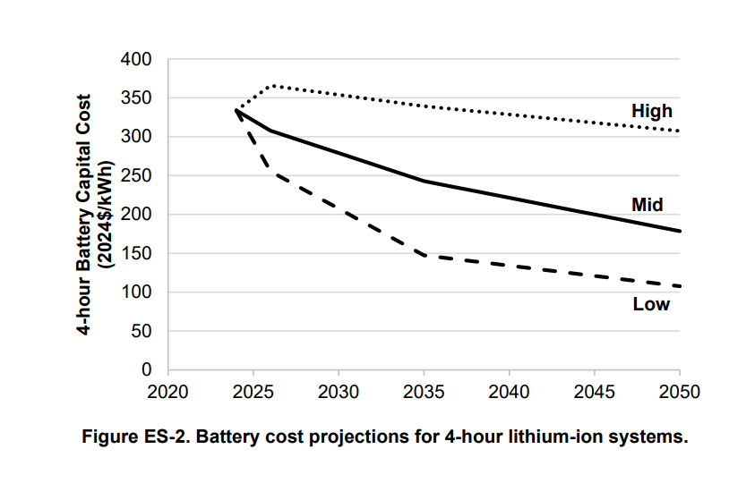

# TO DO

# Revisar degradação da bateria
    [ ] Rodar análise de ia
    [ ] Conferir unidades de energia estão corretas
    [ ] Conferir valores de temperatura
    [ ] conferir unidades do SOC
    [ ] conferir se o acumulo não-linear está OK
    [ ] escala da resistência da bateria
    [ ] Escala do Rendimento do PCS 
    [ ] Escala de tempo

# Implementar módulo financeiro

    [ ] Inserir valores de tarifa
    [ ] Inserir taxas financeiras
    [ ] Analisar metodologias de depreciação
    [ ] Entender o LCOS
    [ ] Listar análises financeiras disponíveis

